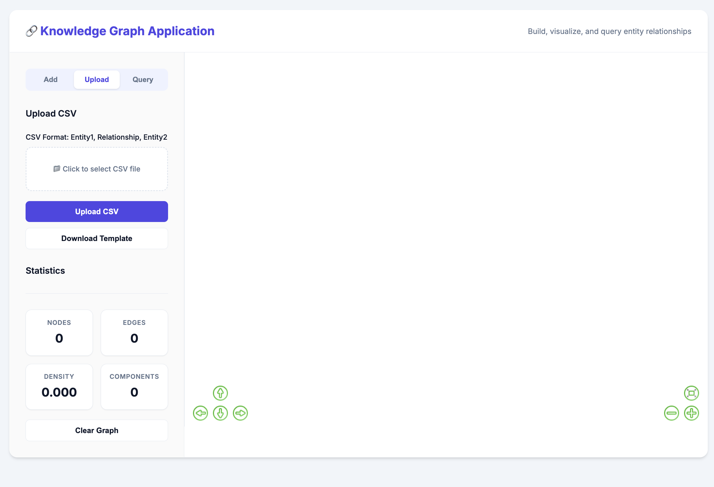
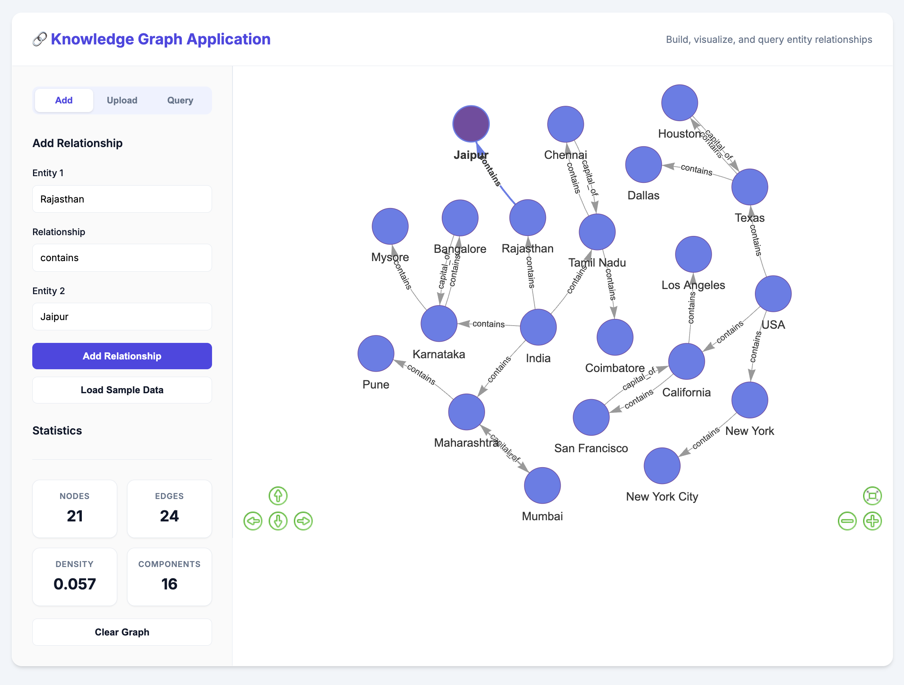
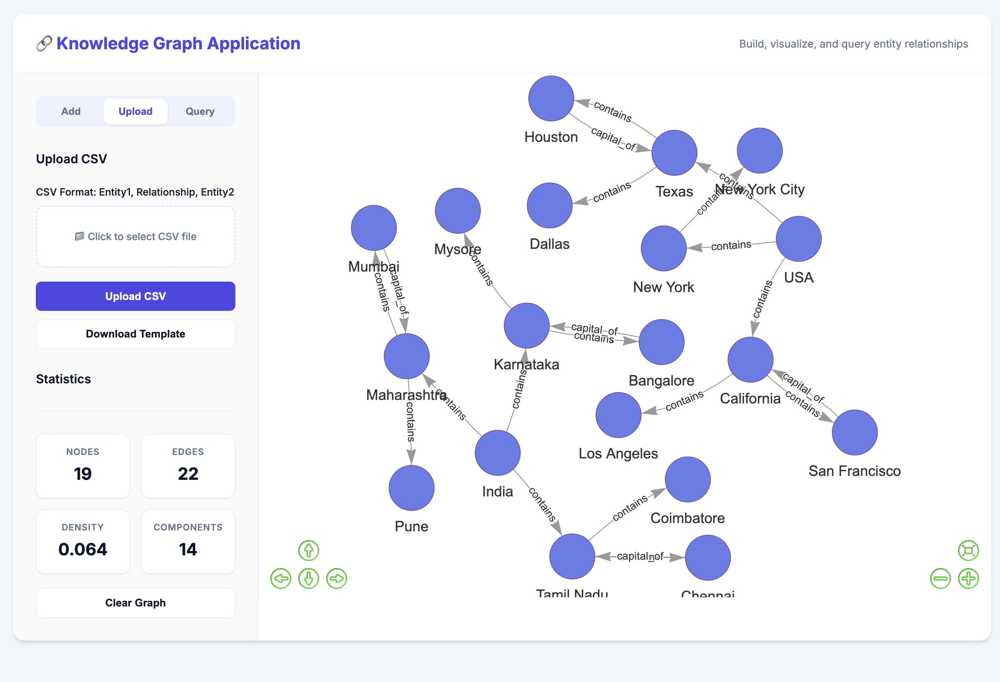
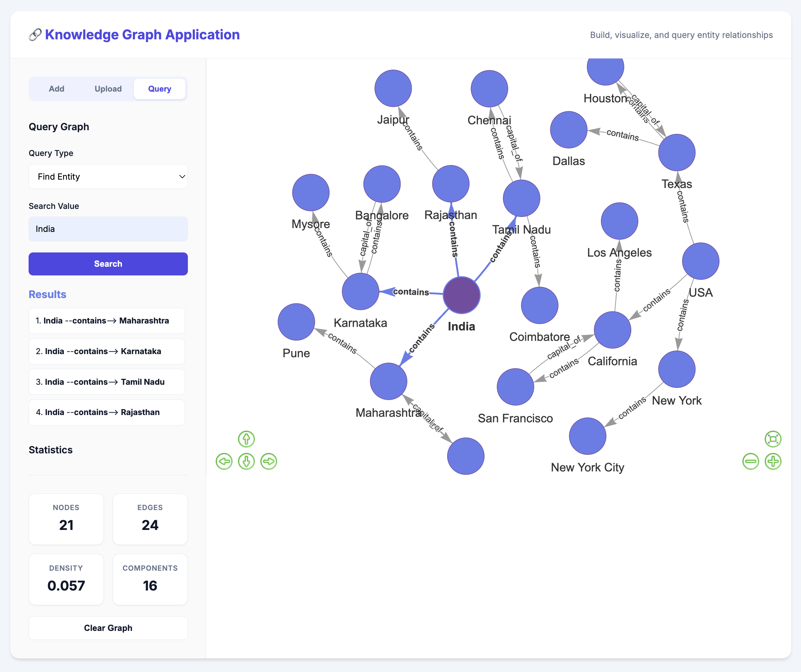

# 🔗 Knowledge Graph Studio

A powerful, interactive web application to build, visualize, and query knowledge graphs. This tool allows users to define relationships between entities, visualize them as a network, and perform complex queries like pathfinding.

## 🌟 Key Features

*   **Interactive Visualization**: Real-time rendering of the knowledge graph using `vis.js`. Zoom, pan, and drag nodes to explore the network.
*   **Relationship Management**:
    *   **Manual Entry**: Add individual relationships (e.g., "Paris" --"is capital of"--> "France").
    *   **Bulk Upload**: Upload CSV files to add hundreds of relationships at once.
*   **Advanced Querying**:
    *   **Find Entity**: Discover all incoming and outgoing connections for a specific node.
    *   **Find Relationship**: Filter the graph by relationship type (e.g., show all "is friend of" edges).
    *   **Find Path**: Calculate the shortest path between two entities using Dijkstra's algorithm.
*   **Graph Statistics**: Real-time insights into node count, edge count, graph density, and connectivity components.

---

## 📸 Screenshots

### 1. Dashboard & Visualization
*Interact with the graph in real-time. The visualization automatically organizes nodes using physics-based layout.*


### 2. Add Relationships
*Manually build your graph one connection at a time.*


### 3. Bulk CSV Upload
*Import large datasets quickly using standard CSV format.*


### 4. Query & Analysis
*Search for entities, relationships, or find the shortest path between nodes.*


---

## 🛠️ Technology Stack

*   **Backend**: Python, Flask
*   **Graph Processing**: NetworkX
*   **Frontend**: HTML5, CSS3, JavaScript
*   **Visualization**: Vis.js
*   **Styling**: Custom CSS (Inter font, smooth UI)

---

## 🚀 Getting Started

### Prerequisites

*   **Python 3.8+** installed on your system.

### Installation

1.  **Clone the Repository** (or download the source code):
    ```bash
    git clone <repository-url>
    cd Knowledge-Graph-Studio
    ```

2.  **Set Up a Virtual Environment** (Recommended):
    *   **MacOS / Linux**:
        ```bash
        python3 -m venv venv
        source venv/bin/activate
        ```
    *   **Windows**:
        ```bash
        python -m venv venv
        venv\Scripts\activate
        ```

3.  **Install Dependencies**:
    ```bash
    pip install -r requirements.txt
    ```

### Running the Application

1.  Start the Flask server:
    ```bash
    python app.py
    ```

2.  Open your web browser and navigate to:
    ```
    http://localhost:8080
    ```

---

## 📖 Usage Guide

### 1. Adding Data
*   Go to the **"Add"** tab.
*   Enter **Entity 1** (Source), **Relationship**, and **Entity 2** (Target).
*   Click **"Add Relationship"**.
*   *Tip: Use the "Load Sample Data" button to quickly populate the graph with example data.*

### 2. Uploading CSV
*   Go to the **"Upload"** tab.
*   Prepare a CSV file with headers: `Entity1`, `Relationship`, `Entity2`.
*   Select your file and click **"Upload CSV"**.

### 3. Querying
*   Go to the **"Query"** tab.
*   Select a **Query Type**:
    *   *Find Entity*: Shows all connections for a specific node.
    *   *Find Relationship Type*: Shows all edges of a certain type.
    *   *Find Path*: Enter "StartNode to EndNode" (e.g., "Shivaji Maharaj to Raigad") to find the connection path.

---

## 🔌 API Endpoints

The application checks provided a RESTful API for integration:

| Method | Endpoint | Description |
| :--- | :--- | :--- |
| `GET` | `/api/health` | Health check to ensure API is running. |
| `GET` | `/api/graph` | Retrieve the full graph structure (nodes & edges). |
| `POST` | `/api/relationships/add` | Add a single relationship. |
| `POST` | `/api/relationships/bulk` | Bulk upload relationships via CSV. |
| `POST` | `/api/query` | Perform graph queries (entity, relationship, path). |
| `POST` | `/api/graph/clear` | Clear the entire knowledge graph. |
| `GET` | `/api/graph/stats` | Get graph statistics (density, components, etc.). |

---

## 📂 Project Structure

```
Knowledge-Graph-Studio/
├── app.py                  # Main Flask application & logic
├── sections/               # Documentation sections
├── screenshots/            # Project screenshots
├── static/                 # Static assets (if any)
├── templates/
│   └── index.html          # Main frontend interface
├── requirements.txt        # Python dependencies
├── .gitignore             # Git ignore file
└── Readme.md              # Project documentation
```

---

*Verified and tested on macOS/Linux/Windows environments.*
